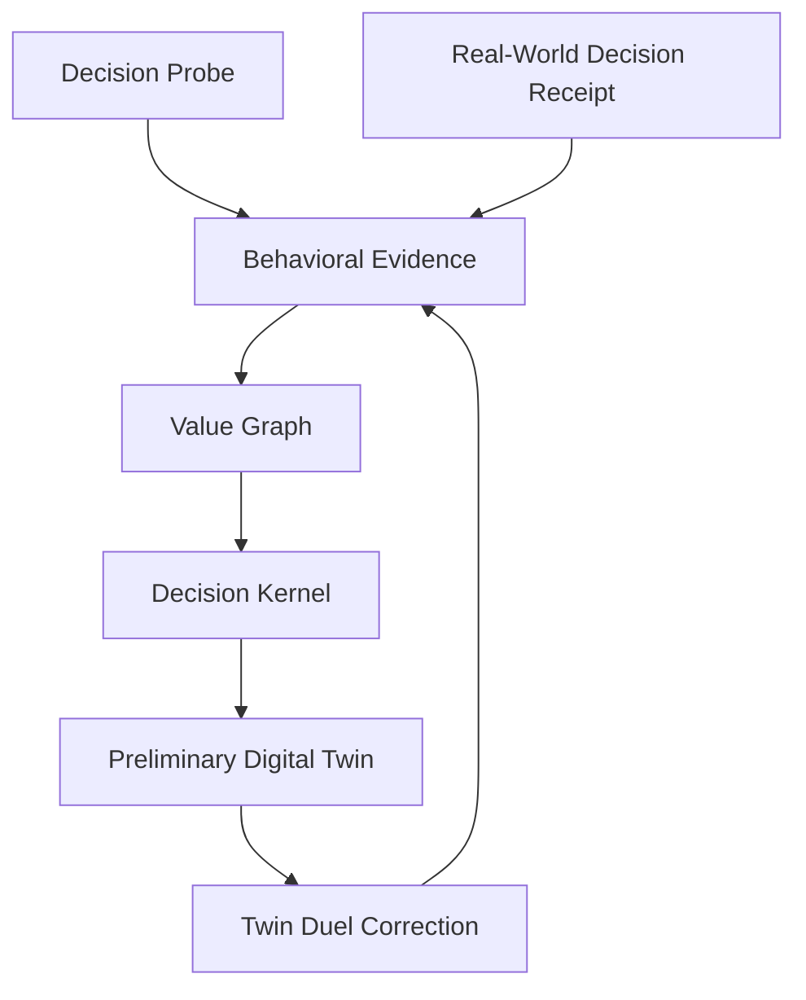
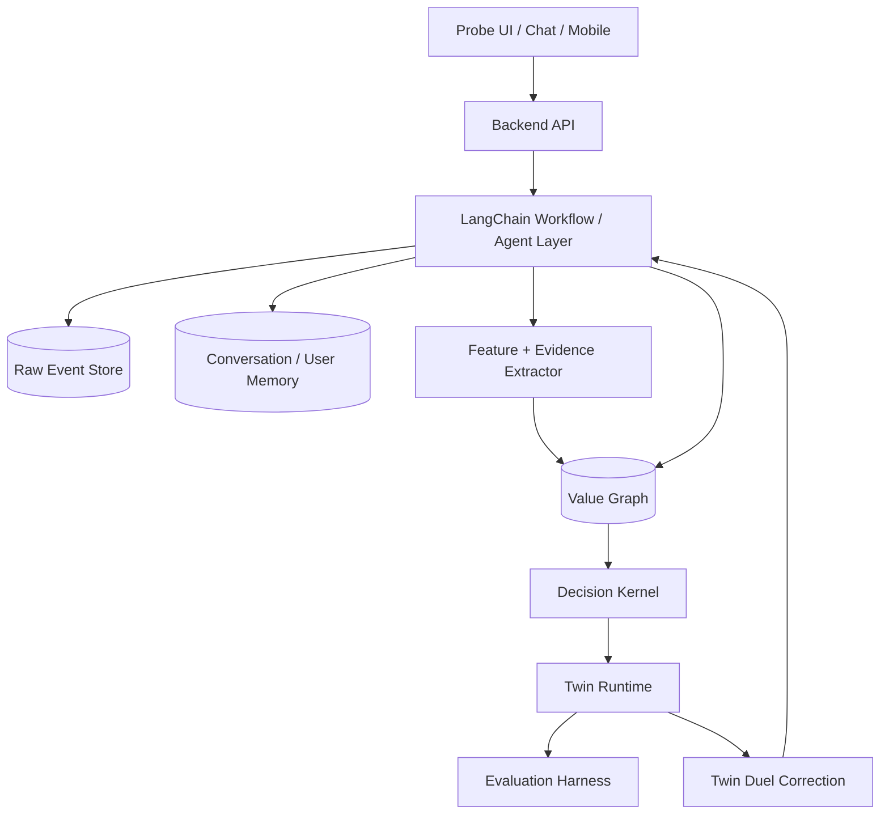
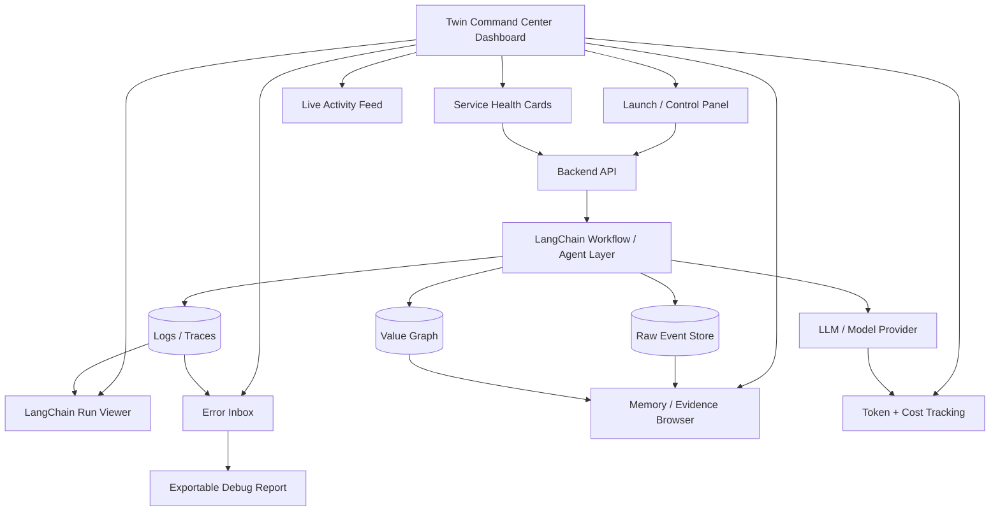
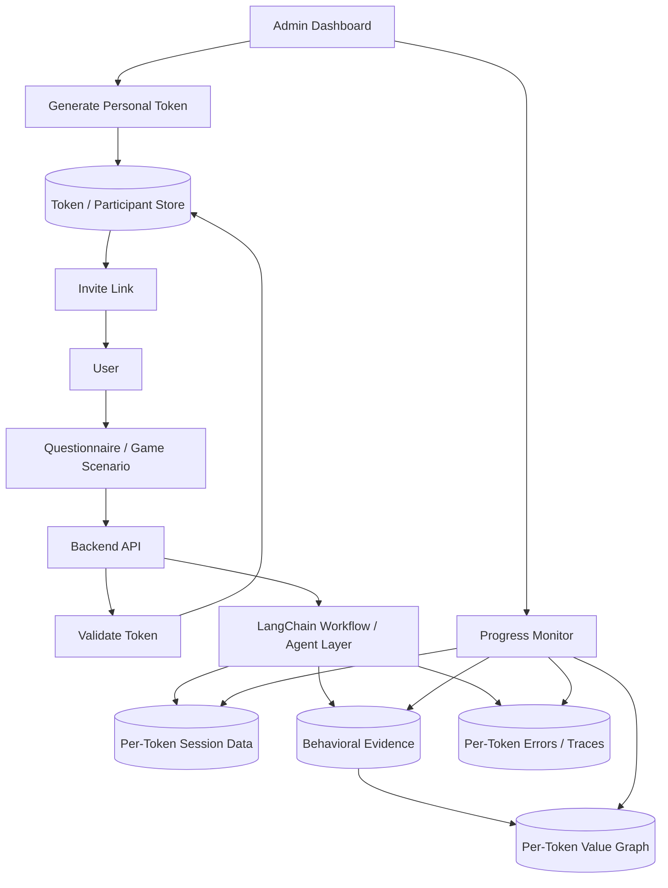

# Digital Twin Direction

> Reference note pulled from Slack channel `#digital-twin`.

## Source

- **Channel:** `#digital-twin`
- **Author:** anieyrudh casual
- **Posted:** 2026-05-18 04:33:48 UTC
- **Pulled:** 2026-05-18 14:09 SGT

## TL;DR

The digital twin should not be treated as a long questionnaire problem. The stronger framing is a **consent-based behavioral mirror** that learns a person’s **decision topology**: what they notice first, how they frame ambiguity, which values reinforce or collide, when context flips their decisions, and how they correct near-miss interpretations.

The goal is to produce a **value graph** and **decision kernel**, not a flat persona profile.

## Core Direction

Canvas is not available on the Slack plan, so the original note was posted as a compact canvas-style message.

The direction is to stop treating the digital twin as a long questionnaire problem. The better frame is a **behavioral mirror** that learns a person’s **decision topology**:

- what they notice first,
- how they frame ambiguity,
- which values reinforce or collide,
- when context flips the decision,
- how they correct near-miss interpretations.

## Core Shift

Instead of asking:

> “What are your values?”

The product should learn:

> “How do your values interact under pressure?”

The output should be a graph of:

- adjacent values,
- opposing values,
- orthogonal values,
- mode switches,
- conditional policies.

It should **not** be a flat persona profile.

## Architecture Direction

`LangChain` should be used as the orchestration and workflow layer for easier development, faster iteration, and tighter integration with the backend modeling logic.

Instead of separating orchestration into `n8n`, the system can keep probes, memory, retrieval, graph updates, evaluation, and correction loops closer to the application code. If the workflow becomes more stateful or multi-step, this can evolve naturally into `LangGraph`.

The core modeling layer should live in a backend service because the following need versioning and testability:

- value graph,
- decision kernel,
- feature extraction,
- evaluation logic.

This keeps the product code-first while still allowing clear workflow composition.

### Why LangChain Fits Better Here

- Keeps orchestration in code instead of workflow UI tooling.
- Makes decision-kernel experiments easier to version with Git.
- Makes tests easier for probes, graph updates, and evaluation logic.
- Fits rapid prototype development better than a heavier workflow setup.
- Leaves room to adopt `LangGraph` later for explicit state machines and durable agent loops.

## Twin Command Center / Monitoring Dashboard

The prototype should include a lightweight monitoring dashboard inspired by OpenClaw-style AI agent dashboards. The goal is to make the Digital Twin system feel like a **command center** rather than a hidden backend process.

This dashboard should help with easy launch, operational visibility, error handling, and reporting while the product is still evolving quickly.

### Purpose

The dashboard should provide one place to:

- launch the local prototype,
- check service health,
- observe LangChain workflow runs,
- inspect probe and correction activity,
- review memory and evidence captured by the twin,
- detect errors early,
- export useful debug reports.

The main idea is to make the twin runtime visible and controllable during development.

### OpenClaw-Inspired Dashboard Feel

The dashboard can borrow the feel of an AI-agent command center:

- **Live activity feed** for probe sessions, twin responses, correction loops, and value-graph updates.
- **Status cards** for backend API, LangChain workflow layer, model provider, memory store, event store, value graph, and frontend.
- **Run/session viewer** for LangChain executions, including inputs, outputs, status, duration, retries, and failure reason.
- **Error inbox** for failed workflow runs, model/provider failures, validation errors, graph-update failures, and infrastructure issues.
- **Memory / evidence browser** to inspect what the twin has learned from probes, receipts, and corrections.
- **Token and cost tracking** for LLM usage during experiments.
- **Agent/workflow state panel** showing whether the system is idle, running, failed, retrying, or completed.
- **Exportable debug report** so failures can be shared, archived, or used for future troubleshooting.

### Core Dashboard Widgets

Initial widgets should stay practical and development-focused:

1. **Launch Panel**
   - Start, stop, or restart local services.
   - Show launch checklist for backend, frontend, database, model provider, and LangChain runtime.

2. **Health Overview**
   - Display simple green/yellow/red health states.
   - Track backend API, LangChain workflow layer, memory store, value graph store, raw event store, and model provider.

3. **Live Activity Feed**
   - Show recent probes, trade-off duels, context flips, twin responses, corrections, and graph updates.
   - Make it easy to see what the system is doing in real time.

4. **LangChain Run Viewer**
   - Show each workflow run with status, duration, prompt/input summary, output summary, retry count, and error state.
   - Useful for debugging chain behavior without digging through raw logs.

5. **Error Inbox**
   - Group errors by category:
     - workflow errors,
     - model/provider errors,
     - validation errors,
     - graph-update errors,
     - memory/retrieval errors,
     - infrastructure errors.
   - Each error should include timestamp, affected session, severity, summary, stack trace or raw detail, and suggested next action.

6. **Memory / Evidence Browser**
   - Inspect behavioral evidence, decision receipts, correction history, and value-graph changes.
   - Avoid exposing unnecessary sensitive data by default.

7. **Usage / Cost Panel**
   - Track token usage, model calls, average latency, failed calls, and estimated cost.
   - Useful when experimenting with different model providers or prompts.

### Error Handling and Reporting

The dashboard should not only show that something failed. It should help explain **where**, **why**, and **what to do next**.

For each error, capture:

- timestamp,
- workflow or chain name,
- session/user reference,
- input summary,
- failed step,
- provider/model used,
- stack trace or raw error,
- retry count,
- whether the error was resolved,
- suggested remediation.

Useful actions:

- retry failed run,
- mark as resolved,
- copy error summary,
- export debug report,
- open related raw logs,
- open related event-store record,
- inspect related value-graph update.

### Suggested Dashboard Architecture

### MVP Dashboard Scope

The first version should be intentionally small:

- local-only dashboard,
- service launch checklist,
- health indicators,
- recent LangChain runs,
- live activity feed,
- error table,
- basic token/cost summary,
- simple debug report export.

### Success Criteria

The dashboard is useful when:

- the prototype can be launched from one place,
- service failures are visible immediately,
- failed LangChain runs are easy to inspect,
- correction-loop and value-graph activity can be monitored,
- errors can be summarized or exported for debugging,
- development feels closer to operating an AI-agent command center than watching terminal logs.

## User Handling / Token-Based Sessions

Each user should run through the questionnaire/game scenario using a **personal token** generated by an admin.

The token acts as the user's access key and prototype identity. All questionnaire answers, game choices, behavioral evidence, correction loops, generated twin responses, and value-graph updates should be saved against that token.

This keeps the MVP simple because users do not need a full account or password system at the start. The admin can generate controlled invite links, send them to participants, and track progress from the dashboard.

### User Flow

1. **Admin generates a personal token**
   - Admin creates a new participant/user from the dashboard.
   - System generates a unique token or invite link.
   - Admin copies and sends the link to the user.

2. **User opens the token link**
   - User enters through a unique questionnaire/game scenario URL.
   - The app validates the token.
   - If the token is valid, the user starts or resumes their scenario.

3. **Scenario progress is saved to the token**
   - Triad responses.
   - Trade-off duel choices.
   - Context-flip scenario responses.
   - Twin response rankings.
   - Rejections and corrections.
   - Behavioral evidence.
   - Value-graph updates.
   - Decision-kernel evaluation history.

4. **Admin monitors user progress**
   - Dashboard shows each token/user status.
   - Admin can see whether the user is not started, in progress, completed, errored, expired, or revoked.
   - Admin can inspect run history, errors, generated evidence, and value-graph updates for that token.

5. **User can resume later**
   - The same token should allow resuming an incomplete scenario.
   - The system should prevent accidental duplicate sessions unless intentionally reset by the admin.

### Token Lifecycle

Tokens should have clear states:

- **Generated** — created by admin but not yet used.
- **Active** — valid and available for use.
- **In progress** — user has started the scenario.
- **Completed** — user finished the questionnaire/game flow.
- **Errored** — scenario encountered a blocking issue.
- **Revoked** — admin disabled access.
- **Expired** — token is no longer valid after a time limit.
- **Reset** — admin intentionally clears or restarts the user's run.

For the MVP, the token can be a long random string stored server-side. Later, it can evolve into signed invite links with expiry, scope, rate limits, and stronger access controls.

### Dashboard Implications

The Twin Command Center should include a user/token management area with:

- create token / invite link,
- copy invite link,
- view participant progress,
- filter users by token status,
- inspect per-token LangChain runs,
- inspect per-token evidence and memory,
- inspect per-token value-graph changes,
- view per-token errors,
- revoke token,
- reset token/session,
- export per-user debug or evidence report.

### Suggested Token-Based Session Architecture

### Privacy and Safety Notes

Because the token links directly to a user's behavioral evidence, it should be treated as sensitive.

MVP safeguards:

- use long unguessable tokens,
- avoid exposing raw sensitive answers in dashboard summaries by default,
- allow admin revocation,
- record token access timestamps,
- do not put private personal details directly in the token itself,
- keep all user data server-side and reference it by token ID.

## MVP Prototype

A 15–20 minute prototype could work as follows:

1. Run **6–8 triads** to elicit personal axes.
2. Run **4–6 trade-off duels**.
3. Replay **2 scenarios** with context flips.
4. Generate **3 twin responses** per scenario.
5. Ask the person to **rank, reject, and correct** the responses.

## Working Thesis

The product is not a questionnaire and not just a game.

It is a **consent-based behavioral mirror system** that learns decision topology through:

- probes,
- real-world receipts,
- correction loops.

## LangChain Analysis Principle

The LangChain analysis layer should optimize for **reliability over token savings**.

This means the system should prefer a multi-pass, auditable analysis pipeline instead of one compressed prompt. Every important claim about the user should be traceable back to source events, supporting quotes, selected options, prompt versions, and model versions.

Reliability-first analysis should include:

- deterministic normalization of raw events,
- per-event extraction,
- context-flip-specific analysis,
- correction-specific analysis,
- cross-event consistency analysis,
- value-graph update proposals,
- structured outputs,
- validation and repair loops,
- retry logging,
- intermediate artifact storage,
- confidence scores,
- source-event citations.

Open-ended context flips and corrections should be treated as high-signal evidence because they reveal when a user's decision policy changes and when the preliminary twin has misunderstood them.

## Notes / Open Sections From Original Message

The original Slack message included headings for the following areas, but no detailed content was provided under them:

- Keystone decision kernels
- Probe design
- Evaluation metrics
